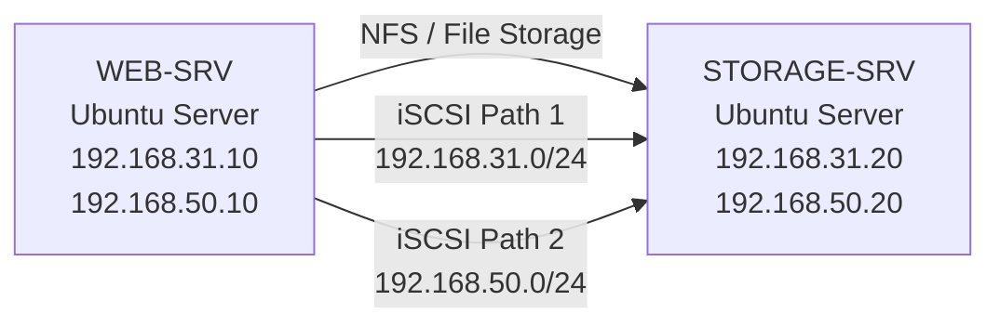
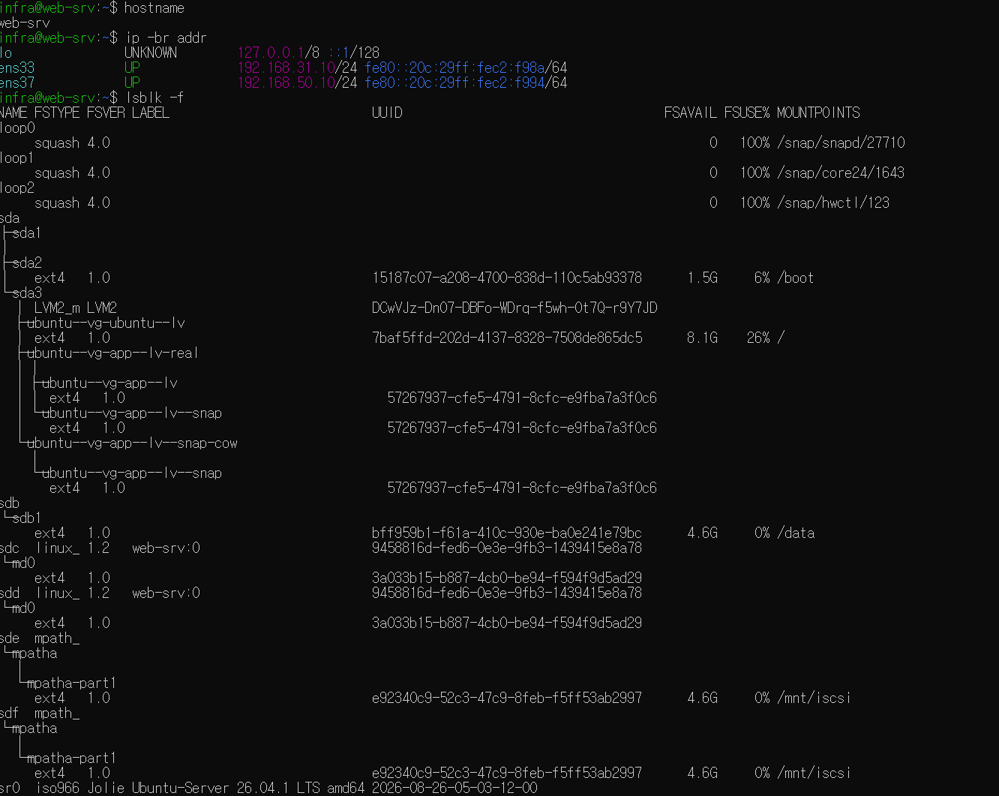
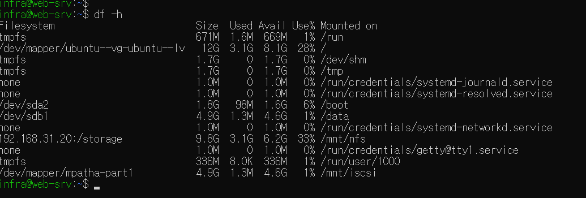
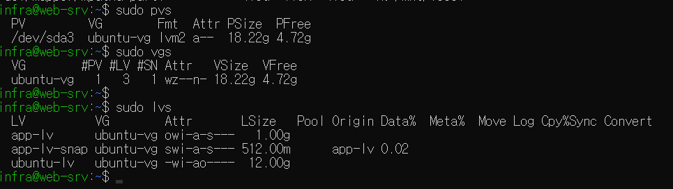
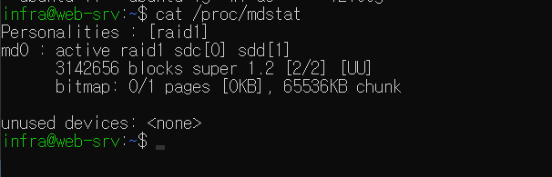
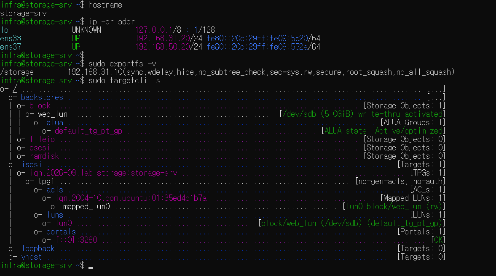
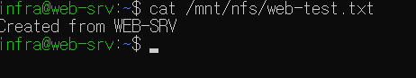
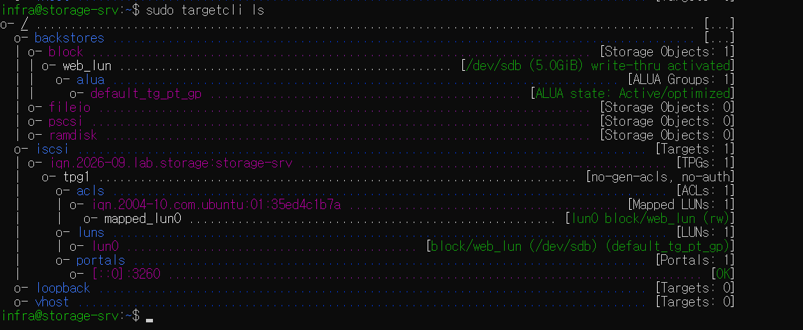
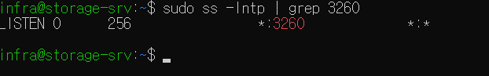
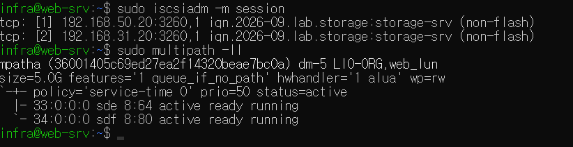

# Linux 기반 서버·스토리지 인프라 및 iSCSI IP-SAN 구축

Ubuntu Server 환경에서 서버·스토리지 인프라를 직접 구성하고  
NFS 기반 파일 스토리지와 iSCSI 기반 블록 스토리지를 구축한 프로젝트입니다.

LVM, RAID1, NFS, iSCSI, Multipath, Snapshot, Backup을 구성하고  
단일 SAN 경로 장애 상황에서도 스토리지 I/O가 유지되는지 직접 검증했습니다.

---

## 1. 프로젝트 목표

시스템·스토리지 엔지니어 직무에 필요한 Linux 서버 운영과 스토리지 구성 과정을 직접 실습하기 위해 구축했습니다.

단순 기능 구현에 그치지 않고 다음 내용을 중점적으로 확인했습니다.

- Linux 디스크 및 파일시스템 관리
- LVM 기반 논리 볼륨 구성 및 확장
- RAID1 구성 및 디스크 이중화
- NFS 기반 NAS 구성
- iSCSI 기반 IP-SAN 구성
- LUN 및 Initiator ACL 구성
- SAN 이중 경로 및 Multipath 구성
- 단일 경로 장애 시 Failover 검증
- rsync 기반 Backup / Restore
- LVM Snapshot을 이용한 시점 복구
- 서비스, 권한, 용량, 스토리지 연결 장애 대응

---

## 2. 인프라 구성



### 서버 역할

| Server | Role |
|---|---|
| WEB-SRV | Linux Client, LVM, RAID1, NFS Client, iSCSI Initiator, Multipath |
| STORAGE-SRV | NFS Server, iSCSI Target, LUN 제공 |

### 네트워크

| 용도 | WEB-SRV | STORAGE-SRV |
|---|---|---|
| Service / SAN Path 1 | 192.168.31.10/24 | 192.168.31.20/24 |
| SAN Path 2 | 192.168.50.10/24 | 192.168.50.20/24 |

---

## 3. Linux Storage 구성

WEB-SRV에 별도 디스크를 추가한 뒤 파티션, ext4 파일시스템, Mount를 직접 구성했습니다.

`/etc/fstab`에 UUID 기반 자동 Mount를 등록하여 재부팅 후에도 디스크가 정상적으로 연결되는 것을 확인했습니다.

주요 구성:

```text
/dev/sdb
└─ /dev/sdb1
   └─ ext4
      └─ /data
```



실제 Mount 상태:



---

## 4. LVM

Ubuntu 설치 시 구성된 LVM 구조를 확인하고 Logical Volume을 직접 확장했습니다.

```text
PV : /dev/sda3
        ↓
VG : ubuntu-vg
        ↓
LV : ubuntu-lv
        ↓
ext4
        ↓
/
```

`lvextend`로 Logical Volume을 확장한 뒤 `resize2fs`를 이용해 ext4 파일시스템까지 확장했습니다.

추가로 실습용 `app-lv`를 생성하고 LVM Snapshot을 구성해 원본 데이터 변경 전 시점의 데이터를 확인하고 복구했습니다.



---

## 5. RAID1

두 개의 가상 디스크를 이용해 Linux Software RAID1을 구성했습니다.

```text
/dev/sdc ─┐
          ├─ RAID1 → /dev/md0
/dev/sdd ─┘
```

RAID1을 통해 동일한 데이터를 두 디스크에 미러링하도록 구성했습니다.

`/proc/mdstat`에서 `[UU]` 상태를 확인하여 두 디스크가 정상적으로 RAID1에 참여하고 있음을 검증했습니다.



RAID는 디스크 장애에 대한 가용성을 제공하지만 파일 삭제나 데이터 손상에 대비한 Backup을 대체하지 않는다는 점도 함께 확인했습니다.

---

## 6. NFS 기반 NAS

STORAGE-SRV의 `/storage` 디렉터리를 NFS로 Export하고 WEB-SRV에서 `/mnt/nfs`로 Mount했습니다.

```text
WEB-SRV                         STORAGE-SRV

/mnt/nfs  ───── NFS ────────> /storage
```

STORAGE-SRV 설정:

```text
/storage 192.168.31.10(rw,sync,no_subtree_check)
```

NFS Export 확인:



WEB-SRV에서 원격 파일 접근 확인:



이를 통해 NFS가 원격 디렉터리를 파일 단위로 제공하는 File Storage 방식임을 확인했습니다.

---

## 7. iSCSI 기반 IP-SAN

STORAGE-SRV의 별도 5GB 디스크를 iSCSI Backstore로 등록하고 WEB-SRV에 LUN으로 제공했습니다.

```text
STORAGE-SRV

/dev/sdb
   ↓
Backstore : web_lun
   ↓
LUN 0
   ↓
iSCSI Target
   ↓
TCP 3260
   ↓
WEB-SRV
```

Target IQN:

```text
iqn.2026-09.lab.storage:storage-srv
```

WEB-SRV의 Initiator IQN만 접근할 수 있도록 ACL을 구성했습니다.



iSCSI 기본 TCP 3260 포트 Listen 상태도 확인했습니다.



WEB-SRV에서는 iSCSI LUN이 로컬 Block Device처럼 인식되며, 클라이언트 측에서 직접 파티션과 ext4 파일시스템을 구성했습니다.

이 실습을 통해 NFS와 iSCSI의 차이를 다음과 같이 확인했습니다.

| 구분 | NFS | iSCSI |
|---|---|---|
| 방식 | File Storage | Block Storage |
| 제공 단위 | 파일 / 디렉터리 | Block Device / LUN |
| 파일시스템 관리 | Storage Server | Client Server |
| 대표 용도 | NAS | IP-SAN |

---

## 8. SAN Multipath 구성

단일 iSCSI 경로 장애에 대비하기 위해 WEB-SRV와 STORAGE-SRV에 두 개의 네트워크 경로를 구성했습니다.

```text
              Path 1
WEB-SRV ================= STORAGE-SRV
31.10                        31.20

              Path 2
WEB-SRV ================= STORAGE-SRV
50.10                        50.20
```

동일한 LUN에 두 개의 iSCSI Session을 연결한 뒤 Linux Multipath를 이용해 하나의 논리 장치로 통합했습니다.

```text
/dev/sde ─┐
          ├─ /dev/mapper/mpatha
/dev/sdf ─┘
```

정상 상태에서 두 Path 모두 `active ready running` 상태임을 확인했습니다.



---

## 9. Multipath 장애 대응

SAN Path 중 하나를 의도적으로 Logout하여 단일 경로 장애 상황을 발생시켰습니다.

장애 발생 후:

```text
iSCSI Session : 2개 → 1개
Multipath     : 남은 Path 정상 유지
Filesystem    : Mount 유지
Data I/O      : 정상
```

남아 있는 경로를 통해 기존 LUN의 파일을 정상적으로 읽고 새 파일을 쓰는 것까지 확인했습니다.


### 장애 대응 과정

```text
단일 SAN Path 장애 발생
        ↓
iscsiadm으로 Session 상태 확인
        ↓
multipath -ll로 Path 상태 확인
        ↓
대체 Path active 상태 확인
        ↓
파일 Read / Write 검증
        ↓
장애 Path 재로그인
        ↓
2개 Path 정상 복구
```

이를 통해 Multipath를 적용하면 단일 네트워크 경로 장애 상황에서도 LUN 접근과 데이터 I/O를 유지할 수 있음을 확인했습니다.

---

## 10. Backup / Restore

WEB-SRV의 애플리케이션 데이터를 STORAGE-SRV의 NFS 영역으로 `rsync`를 이용해 백업했습니다.

```text
WEB-SRV
/srv/appdata
     │
     │ rsync
     ▼
STORAGE-SRV
/storage/backups/web-srv
```

원본 파일을 의도적으로 삭제한 뒤 NFS Backup에서 해당 파일을 다시 복원하여 정상적으로 데이터가 복구되는 것을 확인했습니다.

이를 통해 RAID와 Backup의 목적이 다르다는 점을 확인했습니다.

```text
RAID
→ 디스크 장애 시 서비스 가용성 유지

Backup
→ 삭제·손상된 데이터 복구
```

---

## 11. 장애 대응 경험

프로젝트 진행 중 다음 상황을 직접 발생시키고 원인을 확인한 뒤 복구했습니다.

| 장애 | 확인 | 조치 |
|---|---|---|
| SSH 접속 실패 | systemctl, ss | SSH Service 재시작 |
| NFS Mount 실패 | ping, showmount, systemctl | NFS Service 복구 |
| iSCSI Disk 미인식 | ping, discovery, session | iSCSI 재로그인 |
| Filesystem 용량 부족 | df, du | 대용량 파일 정리 |
| Permission denied | ls -l, namei | chmod / chown 수정 |
| SAN Path 장애 | iscsiadm, multipath | 대체 Path I/O 확인 후 경로 복구 |

장애 발생 시 단순 재부팅보다 다음 순서로 원인을 좁혀가는 방식으로 접근했습니다.

```text
증상 확인
   ↓
서비스 상태
   ↓
Port / Network
   ↓
Storage / Filesystem
   ↓
Permission / Log
   ↓
원인 조치
   ↓
정상 동작 검증
```

---

## 12. 사용 기술

**OS / Virtualization**

`Ubuntu Server 26.04.1 LTS` · `VMware Workstation`

**Linux / Storage**

`LVM` · `ext4` · `mdadm` · `RAID1` · `LVM Snapshot`

**File / Block Storage**

`NFS` · `iSCSI` · `LIO Target` · `targetcli` · `open-iscsi`

**SAN**

`LUN` · `IQN` · `Multipath` 

**Operation / Troubleshooting**

`systemctl` · `journalctl` · `ss` · `lsblk` · `df` · `du` · `rsync` · `Netplan`

---

## 13. 결과

Linux 서버의 기본 운영부터 로컬 스토리지, NAS, IP-SAN까지 단계적으로 구축했습니다.

특히 동일한 iSCSI LUN에 이중 네트워크 경로와 Multipath를 구성하고, 단일 SAN 경로 장애 상황에서도 데이터 I/O가 유지되는 것을 직접 검증했습니다.

이 과정을 통해 서버와 스토리지를 각각 별개의 기술로 보기보다 네트워크, 파일시스템, 서비스, 스토리지 경로를 함께 확인하며 장애 원인을 좁혀가는 인프라 운영 관점을 익혔습니다.
