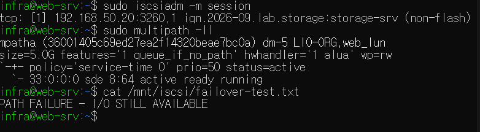

# Troubleshooting

프로젝트 구축 과정에서 주요 장애 상황을 의도적으로 발생시키고  
증상 확인 → 원인 범위 축소 → 조치 → 정상 동작 검증 순서로 복구했습니다.

---

## 1. NFS Mount 장애

### 증상

WEB-SRV에서 STORAGE-SRV의 NFS 공유 디렉터리를 Mount할 수 없는 상황을 발생시켰습니다.

```bash
sudo mount -t nfs 192.168.31.20:/storage /mnt/nfs
```

Mount가 정상적으로 이루어지지 않았습니다.

### 확인 과정

먼저 STORAGE-SRV까지 네트워크 통신이 가능한지 확인했습니다.

```bash
ping -c 3 192.168.31.20
```

Ping은 정상적으로 응답했습니다.

따라서 서버 자체의 네트워크 단절보다는 NFS 서비스 문제로 범위를 좁혔습니다.

NFS Export 접근 여부를 확인했습니다.

```bash
showmount -e 192.168.31.20
```

정상적인 Export 정보를 확인할 수 없었습니다.

STORAGE-SRV에서 NFS 서비스 상태를 확인했습니다.

```bash
systemctl status nfs-kernel-server
```

서비스가 중지된 상태임을 확인했습니다.

### 원인

STORAGE-SRV의 NFS 서비스가 중지되어 있었습니다.

### 조치

```bash
sudo systemctl start nfs-kernel-server
```

서비스 재시작 후 WEB-SRV에서 다시 Mount했습니다.

```bash
sudo mount -t nfs 192.168.31.20:/storage /mnt/nfs
```

### 검증

```bash
cat /mnt/nfs/web-test.txt
```

원격 파일을 정상적으로 읽을 수 있음을 확인했습니다.

### 확인한 점

Ping이 정상이라는 것은 IP 통신이 가능하다는 의미이며,  
NFS와 같은 상위 서비스가 정상이라는 의미는 아니라는 점을 확인했습니다.

---

## 2. iSCSI Session 장애

### 증상

WEB-SRV에서 iSCSI Session을 의도적으로 Logout하여  
STORAGE-SRV에서 제공하던 원격 Block Device가 보이지 않는 상황을 만들었습니다.

### 확인 과정

STORAGE-SRV까지의 네트워크 연결을 확인했습니다.

```bash
ping -c 3 192.168.31.20
```

네트워크는 정상이었습니다.

iSCSI Target 검색 여부를 확인했습니다.

```bash
sudo iscsiadm -m discovery -t sendtargets -p 192.168.31.20
```

Target은 정상적으로 검색되었습니다.

현재 iSCSI Session을 확인했습니다.

```bash
sudo iscsiadm -m session
```

활성 Session이 없는 것을 확인했습니다.

### 원인

네트워크와 iSCSI Target은 정상 상태였지만  
WEB-SRV와 STORAGE-SRV 사이의 iSCSI Login Session이 끊어진 상태였습니다.

### 조치

```bash
sudo iscsiadm -m node \
-T iqn.2026-09.lab.storage:storage-srv \
-p 192.168.31.20:3260 \
--login
```

Target에 다시 로그인했습니다.

### 검증

```bash
sudo iscsiadm -m session
lsblk
sudo mount -a
```

iSCSI Session이 다시 생성되고 LUN이 Block Device로 재인식되는 것을 확인했습니다.

```bash
cat /mnt/iscsi/iscsi-test.txt
```

기존 데이터도 정상적으로 접근할 수 있음을 확인했습니다.

### 확인한 점

iSCSI 장애 발생 시 다음 순서로 문제 범위를 좁힐 수 있었습니다.

```text
Network
  ↓
Target Discovery
  ↓
iSCSI Session
  ↓
Block Device
  ↓
Filesystem / Mount
```

---

## 3. iSCSI Multipath 단일 경로 장애

### 구성

동일한 iSCSI LUN에 두 개의 네트워크 경로를 구성했습니다.

```text
Path 1
WEB-SRV 192.168.31.10
        ↕
STORAGE-SRV 192.168.31.20

Path 2
WEB-SRV 192.168.50.10
        ↕
STORAGE-SRV 192.168.50.20
```

두 경로에서 동일한 LUN을 인식한 뒤 Linux Multipath를 이용해 하나의 논리 장치로 구성했습니다.

```text
/dev/sde ─┐
          ├─ /dev/mapper/mpatha
/dev/sdf ─┘
```

### 정상 상태 확인

```bash
sudo iscsiadm -m session
sudo multipath -ll
```

두 개의 iSCSI Session과 두 Path가 모두 정상 상태임을 확인했습니다.

---

### 장애 발생

Path 1의 iSCSI Session을 의도적으로 Logout했습니다.

```bash
sudo iscsiadm -m node \
-T iqn.2026-09.lab.storage:storage-srv \
-p 192.168.31.20:3260 \
--logout
```

### 확인

```bash
sudo iscsiadm -m session
```

두 개였던 Session 중 하나만 남아 있는 것을 확인했습니다.

```bash
sudo multipath -ll
```

한 Path가 제거된 상태에서도 나머지 Path가 정상적으로 동작하고 있음을 확인했습니다.

### 데이터 I/O 검증

장애 상태에서 기존 Multipath 파일시스템의 데이터 접근을 확인했습니다.

```bash
cat /mnt/iscsi/failover-test.txt
```

또한 장애 상태에서 새로운 데이터를 기록했습니다.

```bash
echo "PATH FAILURE - I/O STILL AVAILABLE" \
| sudo tee /mnt/iscsi/failover-test.txt
```

단일 SAN Path가 끊긴 상태에서도 파일 읽기와 쓰기가 정상적으로 이루어졌습니다.



### 복구

장애를 발생시킨 Path를 다시 로그인했습니다.

```bash
sudo iscsiadm -m node \
-T iqn.2026-09.lab.storage:storage-srv \
-p 192.168.31.20:3260 \
--login
```

복구 후:

```bash
sudo iscsiadm -m session
sudo multipath -ll
```

두 iSCSI Session과 두 Path가 모두 정상 상태로 복구된 것을 확인했습니다.

### 확인한 점

Multipath를 적용하면 동일 LUN으로 가는 복수 경로 중 하나가 장애가 발생하더라도  
남아 있는 경로를 통해 Block Storage I/O를 계속 유지할 수 있음을 확인했습니다.

---

## 4. Filesystem 용량 부족

### 증상

WEB-SRV의 `/data` 파일시스템을 테스트 파일로 채워  
파일을 추가로 기록할 수 없는 상황을 발생시켰습니다.

```text
No space left on device
```

### 확인

파일시스템 전체 사용량:

```bash
df -h /data
```

용량을 많이 사용하는 파일 확인:

```bash
sudo du -sh /data/* 2>/dev/null | sort -h
```

대용량 테스트 파일이 대부분의 공간을 사용하고 있음을 확인했습니다.

### 조치

```bash
sudo rm /data/fill-test.bin
```

### 검증

```bash
df -h /data
```

용량이 확보된 것을 확인한 뒤:

```bash
echo "Application log test" | sudo tee /data/app.log
```

파일 쓰기가 다시 정상적으로 동작하는 것을 확인했습니다.

---

## 5. Permission denied

### 증상

파일의 접근 권한을 제거하여 일반 사용자가 파일을 읽을 수 없는 상황을 발생시켰습니다.

```text
Permission denied
```

### 확인

```bash
ls -l /srv/service-data/data.txt
```

파일 권한을 확인했습니다.

필요한 경우 상위 디렉터리까지 포함해 접근 경로의 권한을 확인했습니다.

```bash
namei -l /path/to/file
```

### 조치

```bash
sudo chown infra:infra /srv/service-data/data.txt
sudo chmod 640 /srv/service-data/data.txt
```

### 검증

```bash
cat /srv/service-data/data.txt
```

파일 접근이 정상적으로 복구된 것을 확인했습니다.

---

# Troubleshooting Approach

프로젝트를 진행하면서 장애가 발생했을 때 바로 재부팅하기보다  
다음 순서로 문제 범위를 좁히는 방식을 사용했습니다.

```text
1. 증상 확인
        ↓
2. Network 연결 확인
        ↓
3. Service 상태 확인
        ↓
4. Port / Session 확인
        ↓
5. Disk / Filesystem / Mount 확인
        ↓
6. Permission / Log 확인
        ↓
7. 원인 조치
        ↓
8. 정상 동작 재검증
```

Linux 서비스 관련 장애에서는 다음 명령을 주로 사용했습니다.

```bash
systemctl status <service>
journalctl -u <service>
```

스토리지 관련 장애에서는 다음 명령을 이용해 각 계층의 상태를 확인했습니다.

```bash
lsblk
df -h
mount
iscsiadm
multipath -ll
```
